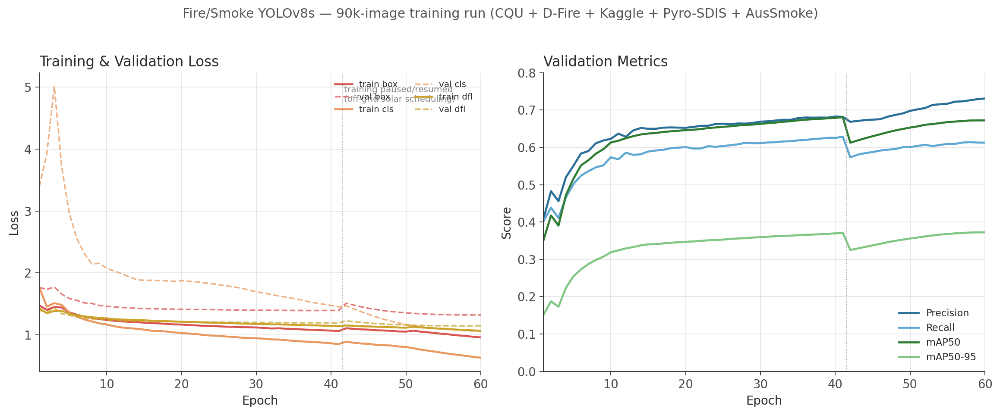

# Aussie Fire & Smoke YOLO

A YOLOv8 fire and smoke detector trained on a combined multi-source dataset
of over 120,000 images, built for real-time camera-based fire/smoke
detection at a rural off-grid property in the Snowy Monaro region, NSW,
Australia.

## Why this exists

Most public fire/smoke detection datasets are dominated by North American
or European wildfire and structure-fire imagery. This project combines
several such datasets with **AusSmoke** (genuinely Australian bushfire and
prescribed-burn imagery, collected near Mount Stromlo, ACT) to produce a
detector that performs well on Australian vegetation, lighting, and smoke
behaviour specifically, not just generic fire footage.

## Model

- Architecture: YOLOv8s
- Classes: `fire` (0), `smoke` (1)
- Input size: 640x640
- Weights: `models/aussie-fire-smoke-yolov8s.pt`
- Inference speed: ~0.8ms/image on an NVIDIA V100

### Validation performance
<!-- METRICS_START -->
| Metric | Overall |
|---|---|
| Precision | 0.727 |
| Recall | 0.613 |
| mAP50 | 0.672 |
| mAP50-95 | 0.372 |

(Metrics from the intermediate ~90k-image training checkpoint. Per-class
fire/smoke breakdown is available in the training logs.)
<!-- METRICS_END -->



The dip in metrics around epoch 42 corresponds to a deliberate pause and
resume of training (the Z840 GPU host is scheduled on/off based on solar
generation and electricity price, since it's off-grid) -- not a training
instability. Metrics recovered and continued improving after the resume.

## Dataset sources and licensing

This project combines six publicly available sources. **Only the code in
this repository is covered by the MIT license below** -- each dataset
retains its own original license, listed here for clarity. This repo does
not redistribute the datasets themselves (see `scripts/` for how to
reconstruct the combined set from original sources).

| Source | Images | License | Link |
|---|---|---|---|
| CQU Fire/Smoke Dataset | ~11,000 | CC BY 4.0 | [figshare](https://doi.org/10.25946/28747046.v1) |
| D-Fire | ~21,500 | CC0 1.0 (Public Domain) | [GitHub](https://github.com/gaiasd/DFireDataset) |
| Fire-and-Smoke-Detection-Dataset (Kaggle) | ~15,300 | MIT | [Kaggle](https://www.kaggle.com/datasets/hussainnasirkhan/fire-and-smoke-detection-dataset) |
| Pyro-SDIS | ~33,600 | Apache 2.0 | [Hugging Face](https://huggingface.co/datasets/pyronear/pyro-sdis) |
| NEWFireSmokeDataset (Catargiu) | ~27,300 | CC BY 4.0 | [GitHub](https://github.com/CostiCatargiu/NEWFireSmokeDataset_YoloModels) |
| AusSmoke (from MultiNatSmoke) | ~15,200 | Permission requested, pending | [GitHub](https://github.com/henryzhao0615/MultiNatSmoke) |

**AusSmoke note**: the AusSmoke portion of this dataset (and, by extension,
some of the learned features in the released model weights) comes from the
MultiNatSmoke benchmark by Li, Zhao, Zhu, Ji, Wilson, Yebra and Barnes (WACV
2026). The AusSmoke component does not carry an explicit open license in
its source repository, so permission to redistribute it (or a derived
version) has been formally requested from the authors and is pending at
time of writing. If you are one of the authors and are reading this,
please get in touch.

If you use AusSmoke data (directly or via this project), please cite:

```bibtex
@InProceedings{Li_2026_WACV,
    author    = {Li, Weihao and Zhao, Hongjin and Zhu, Gao and Ji, Ge-Peng and Wilson, Nicholas and Yebra, Marta and Barnes, Nick},
    title     = {AusSmoke meets MultiNatSmoke: a fully-labelled diverse smoke segmentation dataset},
    booktitle = {Proceedings of the IEEE/CVF Winter Conference on Applications of Computer Vision (WACV)},
    month     = {March},
    year      = {2026},
    pages     = {7996-8006}
}
```

## Scripts

- `scripts/merge_datasets.py` merges CQU, D-Fire, Kaggle, and Pyro-SDIS
  into a single YOLO-format dataset, handling the class-index remapping
  needed since D-Fire's source labels use `smoke=0, fire=1` (opposite to
  the scheme used here).
- `scripts/convert_aussmoke.py` converts AusSmoke's segmentation masks
  into YOLO bounding boxes via connected-component analysis (each
  disconnected smoke region in a mask becomes its own box), since this
  project needs object detection rather than pixel-level segmentation.
- `scripts/merge_catargiu.py` merges the Catargiu dataset, dropping its
  third `other` class (used for hard-negative confusables like sunsets and
  streetlights) since it doesn't map onto this project's two-class scheme,
  and remapping `smoke` from index 2 to index 1.

- `scripts/generate_training_chart.py` builds the loss/metrics chart above
  from any `results.csv` produced by Ultralytics YOLO training. Also called
  automatically by `update_and_push.sh` whenever the model and metrics are
  updated, so the chart always matches the latest results.

To reconstruct the full training set yourself: download each source from
the links above, then run the scripts in this order against your own
local copies. `merge_datasets.py`, `convert_aussmoke.py`, and
`merge_catargiu.py` require only the Python standard library plus numpy,
Pillow, and scipy (for the mask conversion step);
`generate_training_chart.py` additionally requires pandas and matplotlib.

## Training

Trained with [Ultralytics YOLOv8](https://github.com/ultralytics/ultralytics):

```bash
yolo detect train data=data.yaml model=yolov8s.pt epochs=60 imgsz=640 batch=32
```

## License

Code in this repository (the merge/conversion scripts) is MIT licensed,
see `LICENSE`. This does not extend to the datasets themselves, which
retain their original licenses as listed above.
